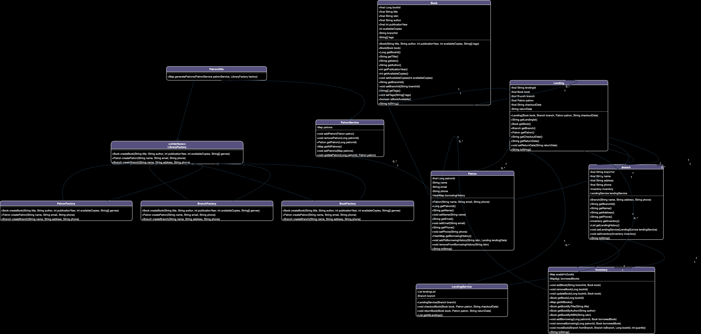

# Library Manager System

## Overview

The Library Manager System is a comprehensive application designed to manage books, patrons, branches, and lending activities within a library. The system handles operations such as book management, patron management, book lending, and returns. It uses an object-oriented approach with various classes and interfaces to encapsulate the functionality.

## Features

- **Book Management**: Add, update, remove, and search for books.
- **Branch Management**: Manage library branches, including inventory and lending services.
- **Patron Management**: Register patrons, manage their details, and track their borrowing history.
- **Lending System**: Checkout and return books, manage lending records.
- **Factory Pattern**: Use factory classes to create instances of books, branches, and patrons.

## Class Diagram

The system is organized into the following main classes:

- **Book**: Represents a book in the library.
- **Branch**: Represents a library branch.
- **Inventory**: Manages the collection of books within a branch.
- **Lending**: Represents a lending transaction.
- **LendingService**: Manages the checkout and return of books.
- **Patron**: Represents a library patron.
- **PatronService**: Manages patron records.
- **LibraryFactory**: An interface for creating library-related entities.
- **BookFactory**, **BranchFactory**, **PatronFactory**: Concrete implementations of `LibraryFactory`.




## Usage

### Setup

1. **Create Branches**:
    ```java
    LibraryFactory branchFactory = new BranchFactory();
    Branch branch = branchFactory.createBranch("Branch 1", "Address 1", "1234567890");
    ```

2. **Add Books**:
    ```java
    LibraryFactory bookFactory = new BookFactory();
    Book book = bookFactory.createBook("Book Title", "Author Name", 2024, 10, new String[]{"Genre"});
    branch.getInventory().addBook(branch.getBranchId(), book);
    ```

3. **Register Patrons**:
    ```java
    LibraryFactory patronFactory = new PatronFactory();
    Patron patron = patronFactory.createPatron("Patron Name", "patron@example.com", "1234567890");
    PatronService patronService = new PatronService();
    patronService.addPatron(patron);
    ```

4. **Checkout and Return Books**:
    ```java
    LendingService lendingService = new LendingService(branch);
    branch.setLendingService(lendingService);
    lendingService.checkoutBook(book, patron, "2024-01-01");
    lendingService.returnBook(book, patron, "2024-01-15");
    ```

5. **Move Books Between Branches**:
    ```java
    Inventory inventory = branch.getInventory();
    Branch branch2 = branchFactory.createBranch("Branch 2", "Address 2", "0987654321");
    inventory.moveBook(branch, branch2, book.getBookId(), 1);
    ```
